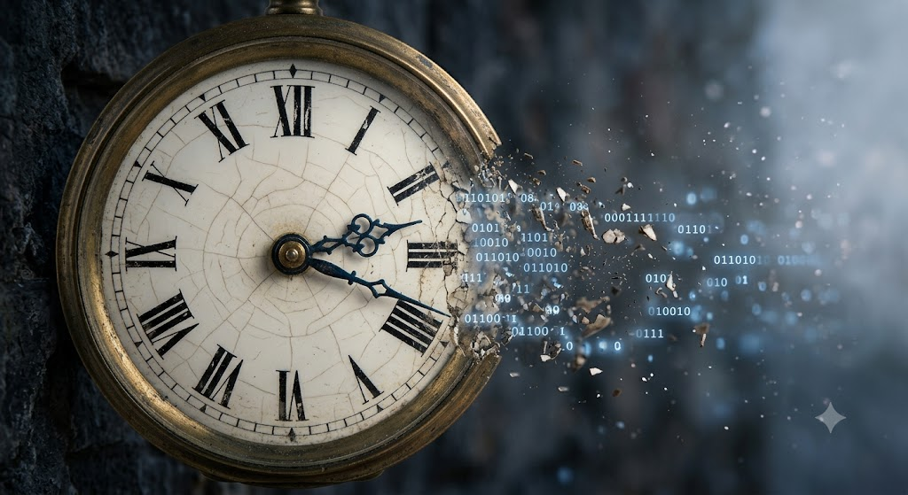
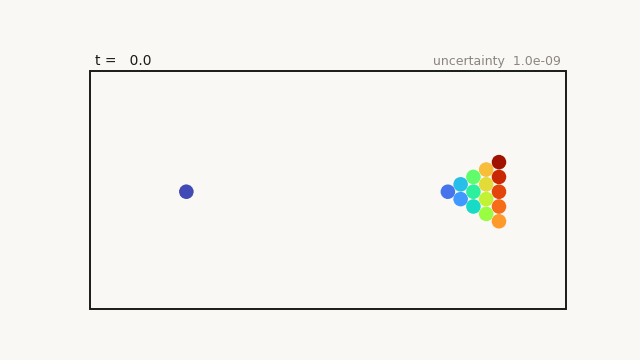
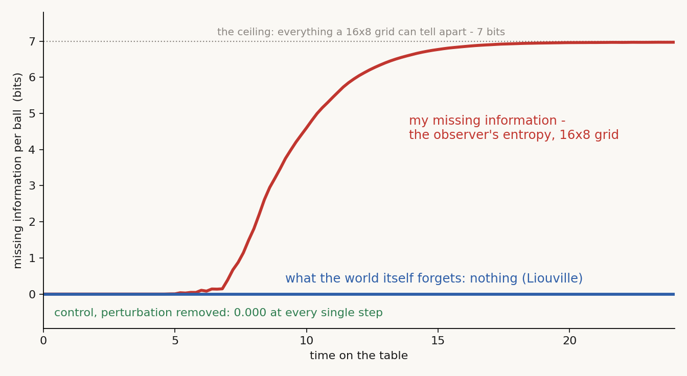
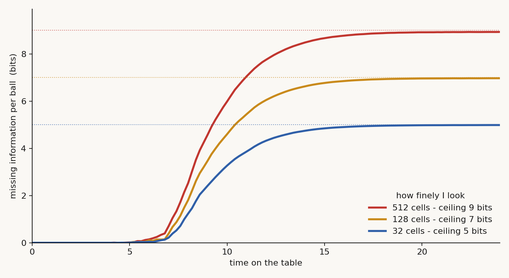
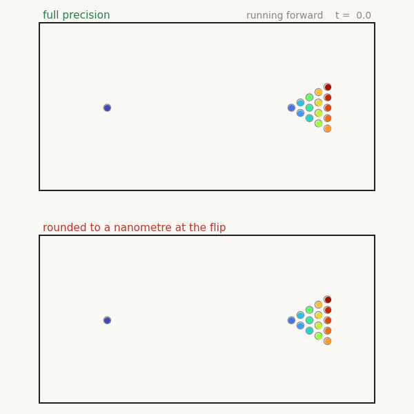
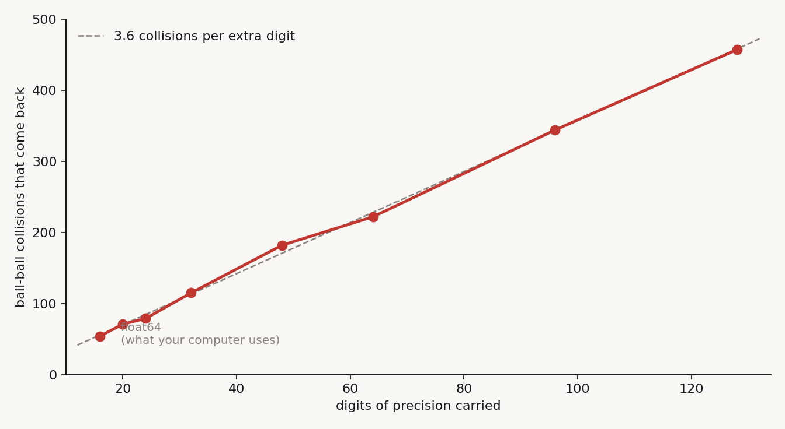

# I Never Understood Entropy

*Quest for Entropy #4: I built a billiard table with sixteen balls and no friction, to find out what entropy actually is.*

## The question

A break shot is the most ordered thing that ever happens on a billiard table. Fifteen balls in a tight triangle, one ball moving, everything else still. Ten seconds later it is a mess, and it is never going to be a triangle again.

I have to admit something. For most of my life I did not understand why.

I was given the answer at school. Entropy. S equals k log W. Microstates and macrostates. On the surface it looked simple, and I could repeat it back. Then I started pushing on it and it came apart in my hands.

This publication is called *Quest for Entropy* and we are four episodes in, so it is time I said where the name comes from. The first three episodes showed a machine that copies quantum behaviour: [how it works](https://questforentropy.substack.com/p/the-machine), and [twenty exams we put it through](https://questforentropy.substack.com/p/the-machine-takes-a-quantum-exam). This one goes back to before all of that. No quantum mechanics anywhere in it. Just a table, sixteen balls, and the question I could not answer.

What restarted it for me was a video: Sean Carroll's *[Entropy and Information](https://www.youtube.com/watch?v=rBPPOI5UIe0)*. It told me there is more than one entropy. That was the first crack in the wall — though the piece that finally made it click for me came from somewhere else entirely: not from heat, but from information.

## What I was taught

Boltzmann's version goes like this.

Pick a question about the table. Say: how many balls are on the left half? That question has seventeen possible answers, from zero to sixteen. Each answer is a **macrostate** — a rough description, the kind of thing you can actually see from across the room.

Now count how many exact arrangements give each answer. All sixteen balls on the right: exactly one way. Eight and eight: 12,870 ways. Entropy is just that count, written small enough to be readable — the logarithm.

So the balls end up mixed because there are 12,870 times more ways to be mixed than to be racked. That is the entire argument.

And here is the part nobody said out loud when I was taught it, the part that would have helped: **nothing pushes the balls apart.** There is no force of disorder. No arrow inside the physics. The balls bounce, the bouncing is blind, and blind wandering lands you in the big pile because the big pile is big.

Two things hide in that formula, and both bothered me later. First: this entropy is not a property of the balls. It is a property of the *question I asked about them* — ask "how many on the left" and you get one number, ask "how many are red" and the same arrangement gives another. Second: there is no clock in it. It says the mess is overwhelmingly more likely. It never says how fast, and it never says what, exactly, I am losing. Hold both. They are the whole article.

## The two things I could not get past

**One: the small print.** If it is only counting, then the racked triangle is not forbidden. It is just rare. Wait long enough and the balls should wander back into a triangle by themselves.

That is not a loophole I invented to be clever. It is a theorem — **Poincaré recurrence**. A closed system with fixed energy has to come back arbitrarily close to where it started, and then do it again, forever. So in what sense is the second law a *law*? Laws are not supposed to have "eventually, no" written in the footnotes.

**Two: the brains.** Somewhere in the reading I met the Boltzmann brain, and it lost me completely.

The argument runs: suppose the universe is a random fluctuation out of an eternal soup. Small flukes are enormously more likely than big ones. A single brain, complete with a lifetime of false memories, is a much cheaper fluke than an entire fourteen-billion-year-old cosmos. So almost every observer should be a lone brain hallucinating in the dark.

My reaction was that this is nonsense. Clouds make horse shapes. Clouds do not make horses. Yes, a fluke could produce a leaf. A tree is worse. A forest, forget it.

But then I noticed what my own objection was actually saying. **Give me a seed, and the forest costs nothing extra.** A seed is small. A seed grows. You do not need a fluke for the forest, you need a fluke for the seed, once.

I was pleased with that until I found out it is the standard answer and it already has a name: the **Past Hypothesis**. The universe did not fluctuate into being — it *started* in a state of very low entropy, and everything since is that seed unfolding. The brains were never a prediction that brains appear in space; they were an argument by absurdity, built to kill the fluctuation picture. Which is what I had been trying to do, only worse, and about seventy years late.

Why the universe started that ordered is still open, and I did not solve it. But I stopped being confused about the question.

## The other entropy

Then I learned there is a second definition, Gibbs's, and it asks something different. Not "how many ways could this look like that", but **"what do I actually know?"** You have a spread over the possible states. Know the state exactly, and your entropy is zero.

That made far more sense to me. And then it walked straight into a wall.

Under exact mechanics, that entropy **never changes**. This is Liouville's theorem: whatever you know about the system now, the dynamics carries it forward without losing a drop. Every state has exactly one past and exactly one future, so possibilities are never created and never merged. On this definition, nothing ever happens. The second law does not exist.

The textbook fix is called coarse-graining — smear your knowledge over a grid of cells, and the smeared entropy grows. It is correct, and it never satisfied me. It felt like an accounting trick. *Where* is the loss actually made? What exactly runs out? And at what rate?

The answer that finally worked for me did not come from thermodynamics at all. It came from asking a software question: what does "knowing the state" physically mean?

## The notebook

Knowing something means having it written down. A notebook with numbers in it. So let me ask the question properly: can a finite notebook hold the exact state of a system, forever?

Sometimes — yes. Take one ball on this table, no friction. I write down its exact position and momentum, and I write down the solution formula. Now I can answer "where is the ball at time t?" for *any* t: plug in the number, read off the answer. Notice what that formula really is: **a compression of the entire infinite future into one line.** My notebook stays the same size forever. Systems like this are called *integrable*, and they are why physics got famous — two bodies under gravity are integrable, which is why Newton could do astronomy with a quill.

Then, in 1890, Henri Poincaré tried to do the same for **three** bodies and discovered the formula does not exist. Not "has not been found". Does not exist. For such systems there is no line you can plug t into — no shortcut. The only way to know the future is to walk there, step by step, paying full price for every step. Stephen Wolfram's name for this is **computational irreducibility**, and it is the deepest split in dynamics: futures that compress, and futures that don't.

Our sixteen balls are on the wrong side of the split, and you can watch the notebook fail concretely. Suppose I refuse to round anything and use exact numbers, like a computer algebra system does. Fractions survive free flight, and they survive wall bounces. But every ball-ball collision requires solving a quadratic equation for the moment of contact — and a quadratic root drags a **square root** into the state. The next collision takes a square root *of an expression that already contains square roots*. One storey per collision. The numbers in my notebook do not just change; they get **longer**. And no clever notation can flatten that tower — a notation in which the state stayed short at all times would *be* a solution formula, and Poincaré showed there is none. The growing notebook is not sloppy bookkeeping. The growing notebook *is* the chaos, seen from the information side.

There is one loophole, and closing it is the best part. I could keep the notebook short forever by writing just three things: the starting state, the rule, and the current time. That description never grows. But to *use* it — to answer "where are the balls now?" — I must replay the entire history, collision by collision, because there is no jumping ahead. The state is cheap to name and expensive to unfold. So a bounded observer is trapped from both sides: it cannot store the unfolded state, because the notebook must grow without limit — and it cannot lean on the compressed one, because unfolding it means re-computing everything the world has ever done, at least as fast as the world does it. **Memory or compute: pick either, chaos breaks it.** The only observer that keeps up is one that grows forever. Nobody grows forever.

So here is the fork every real observer faces at every collision: let the notebook grow — or round. And rounding has a price with a clock on it.

## The run

We built the table to watch that price get paid. Sixteen balls, elastic walls, no friction, and collision times solved exactly rather than stepped through, so the whole thing runs backwards as cleanly as it runs forwards.

The experiment: simulate the same table four thousand times over, with starting positions differing by **one nanometre**. One table is the truth. The other 3,999 are the contents of a rounded notebook — every state that agrees with what I wrote down.

Watch what happens. For a long time, nothing. The ghosts sit exactly on top of the real balls and the table looks perfectly predictable. Then, inside about two seconds, it dissolves.

Why so violently? Because a billiard ball is a **convex mirror**. Two paths that arrive almost parallel hit that curved surface and leave *diverging*. Every collision magnifies whatever you got wrong, and the magnification compounds. You do not need three bodies for this — roundness does it with two. Michael Berry worked out the honest scale for a real table back in 1978: to predict the ninth collision you need to include the gravitational pull of a person standing beside the table; by around the fifty-sixth you would need a single electron at the edge of the observable universe.

On our table the blur has an exact clock: **whatever I failed to write down doubles every 0.28 time units — about one bit of my notebook spent per collision.**

And there is a second way to read that cloud, which is the way this whole series reads it. The ghosts are my honest bets — a **probability map** of where to look for each ball. At the start the map is a needle: all the probability piled on one tiny spot, the density enormous. Chaos stretches and folds the needle; the density falls as the territory grows; at the end the map is flat, and a bet on any patch of felt is as good as a bet on any other. Missing information and probability density are one object seen from two sides: entropy is the log of the area my bets must cover.

Now the picture I had been missing all those years. The red curve is my **missing information**, measured live: divide the table into a grid, and count the bits I would need to say which cell each ball is in. It starts at zero — every ghost agrees — and it climbs to the ceiling, the point where a ball could be in any cell at all.

The blue curve is what the *world itself* forgets during the same run: nothing, ever — Liouville's theorem. Put that in this series' language: the universe is the one observer exactly as big as itself. Its notebook is itself, so its books are perfect by definition — and unusable by anyone living inside it, because no smaller notebook can copy them, and nothing inside the computation can run ahead of it. The blue line is not there to comfort us. It has exactly one job: it guarantees that what the rewind, below, will try to recover still exists. For every observer smaller than the world, the red curve is the law.

And the control, because a blur made by sloppy arithmetic would look exactly the same on screen: same four thousand copies, same everything, with the nanometre removed. The spread stays at **0.000 at every single step**, bit for bit. The fog is the nanometre. It is not the computer.

Here is the formula this gives you, and it is the one I wish someone had written on the board next to Boltzmann's:

**S = log W — where W is the number of states that still agree with your notebook.**

It is Boltzmann's own formula. The only change is what you condition on: Boltzmann counts the states consistent with a *question* ("how many on the left?"); this counts the states consistent with a *record*. And unlike the school version, this one comes with a growth law. Between looks, W multiplies at a fixed rate, so:

**missing information ≈ h × time** — until it hits the ceiling, log of however many states your resolution can tell apart.

That rate h is a named, measurable quantity — the **Kolmogorov–Sinai entropy** — and it even has its own formula: h is the sum of all the positive stretching rates of the dynamics (Pesin's theorem). On our table, h is about one bit per ball-ball collision, and the red curve climbing at that rate *is* the second law, live on screen. Why can it only climb between looks? Because no amount of thinking adds information about a system you are not measuring — computation can reshuffle what the notebook already holds, never add to it — while chaos keeps promoting digits you never wrote down into behaviour you can see.

One more turn of the screw. Same run, three observers, differing only in how finely they look: 32 cells, 128 cells, 512 cells. Three curves, three ceilings — 5, 7 and 9 bits per ball — three different answers to "what is the entropy of this table right now". None of them is wrong. Entropy is not sitting in the balls waiting to be read off. The *rate* belongs to the dynamics; the *amount* and the *ceiling* belong to the question you are able to ask.

That is where the definition finally landed for me:

> Count the states that still agree with your notebook, take the log. That is entropy — Boltzmann's formula, pointed at the observer's record instead of at a question. Chaos gives it a clock: on this table, about one bit per collision.

I should be fair here: you do not need an observer at all to get the arrow of time. Boltzmann's counting does it alone, with nobody in the room. Both pictures are correct. I am telling you which one made the lights come on for me, not which one is true. And I was relieved to learn this is not a private heresy of mine: making entropy precise *relative to what an observer can resolve* is an active research programme with a name — **observational entropy** — running since 2019 (Šafránek, Deutsch, Aguirre; credits below). The definition I groped my way to is theirs, done professionally.

And the thing that used to bother me most no longer does. When Poincaré's recurrence finally comes around and the triangle reassembles by chance, it changes nothing: **the world rewinds, my notebook does not.** Nothing on that table ever dies, either. The balls keep moving at full speed forever. What ends is my ability to say where they are.

## The rewind

Which leaves one question. If the physics really is reversible, and the world forgets nothing, then let us just go back and get it.

So we did. Run the table forward. Flip every velocity — every ball, exactly, at one instant. Run it forward again for the same amount of time. If the mechanics are reversible, the mess should walk backwards into a perfect triangle.

It does. Look at the top panel: the balls slide back into the grey rings where they started, and the cue ball parks itself back on its spot. Every collision un-happens in the right order. Josef Loschmidt raised exactly this objection to Boltzmann in 1876, and Loschmidt was right — the microscopic laws have no preferred direction.

The bottom panel is the same run, same flip, one difference. Before reversing, we rounded every number to nine decimal places. On a table one metre wide, that is rounding to a nanometre. That is all.

It never comes back. It runs backwards into a *different* mess, and by the end the balls are nowhere near their rings.

So the information really is all still there. Reversibility is real. It just belongs to whoever can afford the notebook.

And the price is measurable, which is my favourite part of this whole episode. We ran the rewind at higher and higher precision and counted how many collisions come back before the triangle stops reassembling. Sixteen digits — what your computer uses by default — buys fifty-four collisions. Then we doubled the digits, and doubled again, up to 128. The horizon never doubles with them. It creeps: every extra digit of precision buys about **three and a half more collisions**, in a straight line across the whole sweep.

That straight line is the growth law from the last section, read backwards: an observer with an M-digit notebook stays effectively exact for about M × 3.6 collisions of grace — and then decays at the same one bit per collision, no matter how fast its computer is. Losing and paying are the same exchange rate, and that this is exactly true is a theorem (Brudno's), not a coincidence of our table.

It is the most hopeless deal in physics. The balls are reversible. The break shot can be un-broken. It just costs digits, the price is exponential, and I can never afford the ticket.

Underneath, nothing is lost. On my side of the table, everything is. That gap is not a flaw in the physics — it is where the arrow of time comes from. And four episodes later, it is still the only thing this quest is about.

## Everyone is an observer

One last step, because "observer" may sound like it means a person with a notebook, and it does not.

Any subsystem that carries a record is an observer. A particle's state is a record of what has hit it. A rock, a thermostat, a brain — anything whose present configuration depends on the past of things around it is keeping notes, well or badly. And every one of them is finite. So every part of the world is slowly going stale about every other part, one way, on the same clock. That shared, one-way staleness is, as far as I can tell, what we call the arrow of time.

Can't you just look again? Yes — and looking is physical. Refreshing a record costs work, and resetting one exports at least as much entropy as it removes; that is how Maxwell's demon actually dies, not by being forbidden to measure but by drowning in its own full notebook. Life is the best customer of this rule, not an exception to it: it keeps its local books clean by paying the bill outward. And one honest caveat, carried over from earlier: staleness can only grow if there is room to grow. If the universe had started at the ceiling, everyone would already know nothing about everyone. The arrow needs the Past Hypothesis — the seed — as much as it needs the clock.

## The Confession

Three things, and the first one is the big one.

**None of this is new.** Boltzmann, Gibbs, Liouville, Poincaré, Loschmidt, Kolmogorov, Sinai, Pesin, Brudno, Bennett, Berry — all of it is textbook or published theorem, most of it old. What is mine here is the confusion and the route out of it, not the physics. If you already knew all this, you knew all this.

**The numbers we quote are floors, not totals.** Our red curve tracks each ball separately and ignores what leaks into the *correlations between* balls, so the true missing information is higher. And our measured rate rides the largest stretching direction; the full Kolmogorov–Sinai rate sums all of them, so it is larger still. Same currency, partial count.

**The rewind is a demonstration, not a claim about nature.** The computer's rounding stands in for a bounded observer's limits. It shows the mechanism cleanly. It does not prove the universe does it this way.

## What this does NOT claim

> This is a **toy and a teaching machine, not a result.** Sixteen balls on a rectangle are not a gas, not a universe, and not evidence about either. Nothing here is new mathematics — the growth law, the rate and the theorems connecting them are standard. It does not claim entropy is "subjective": the counting version needs no observer at all and it is right there in the same article, and for everyday thermodynamics all reasonable observers agree on the numbers. It does not explain why the universe began in a low-entropy state, and it does not touch quantum mechanics anywhere.

## The neighbors and the credits

Everything in this episode belongs to someone else. **Ludwig Boltzmann** for the counting, and the formula that is carved on his gravestone. **J. Willard Gibbs** for the version that asks what you know. **Joseph Liouville** for the theorem that the world forgets nothing. **Henri Poincaré** for both ends of the trap — the three-body problem, where the no-shortcut world was discovered in 1890, and the recurrence theorem. **Josef Loschmidt** for the reversibility objection our rewind re-enacts. **Andrey Kolmogorov**, twice — he built the theory of the loss rate *and* the theory of description length, two different inventions of one man. **Yakov Sinai** for making the rate rigorous and for proving hard-ball billiards really are chaotic; **Yakov Pesin** for the formula that computes the rate; **A. A. Brudno** for the theorem that the growing notebook and the decaying prediction are the same number. **Michael Berry** for the electron at the edge of the universe. **Stephen Wolfram** for the name of the wall itself, computational irreducibility. **Leo Szilard**, **Rolf Landauer** and **Charles Bennett** for the demon's true cause of death — the cost of the notebook. **[E. T. Jaynes](https://bayes.wustl.edu/etj/articles/gibbs.vs.boltzmann.pdf)** for arguing, long before it was popular, that entropy is a property of your description. **Dominik Šafránek, Joshua Deutsch and Anthony Aguirre** for [observational entropy](https://arxiv.org/abs/1707.09722) — the current research programme that makes "entropy relative to what an observer can resolve" rigorous, and the professional home of the definition this episode arrives at. **Nicolas Gisin** for the nearest neighbouring heresy — he argues nature itself holds only finite information, while this series keeps nature exact and makes only the observers finite. **Wojciech Zurek** for the quantum version of records and staleness, which is where the rest of this series lives.

And **[Sean Carroll](https://www.youtube.com/watch?v=rBPPOI5UIe0)**, whose lecture is what restarted this for me. His book *From Eternity to Here* is where I would send anyone who wants the Past Hypothesis and the arrow of time properly.

## Run it yourself

Everything above is in one repository: **[quest-for-entropy-i-never-understood-entropy](https://github.com/masteris777/quest-for-entropy-i-never-understood-entropy)**. One command, about four minutes, no third-party libraries needed for the simulation itself:

`python run_all.py`

It re-runs the ensemble, the control, the missing-information curves at all three resolutions, the rewind at every precision, and regenerates every figure in this article from scratch. If a number here does not match what it prints, the number here is wrong.

There is also a version you can play with in the browser: **[the break shot](https://quest-for-entropy.web.app/the-break-shot)**. Two knobs — how wrong your starting knowledge is, and how carefully you are looking — plus a rewind button with a rounding dial. Turn the resolution knob and watch the same run report a different entropy. That one knob is the article.

## How this was made

I'm a software architect. The physics and the deep math are what I'm curious about, not my job, and I use AI to explore them. The honest split: the heavy lifting — the math, the physics checks, the code, the sums — is AI, with me setting the direction, asking the questions, and making the calls. Main models: Anthropic Fable 5, Opus 5 and Sonnet 5, with support from DeepSeek v4 Pro. To keep us honest, the work runs through a harness I built: every experiment follows rules fixed in advance, results get challenged by independent AI review, and every mistake we catch goes into a public honesty ledger. Every number here comes from code you can run, not from a model's memory.

## Next time

Chaos turns my ignorance into a probability cloud, on a measurable clock — and on this table the cloud has a boring fate. It flattens into a uniform grey and stays there forever. So I asked the question that started this whole quest: does it have to? Could there be a chaotic system whose probability cloud refuses to flatten — one that holds a shape, sloshes, oscillates, maybe even makes waves? A standing wave built out of ignorance: that was my original idea for where quantum probability might come from. Next time I go and measure it — four deterministic worlds and a drum — and find out that some clouds really do keep waving forever, but only the ones that never lose anything.

---

*Quest for Entropy is written by Marijus Masteika. Entropy was always the dark horse for me — connected to information, and maybe hiding answers to everything. That's the quest.*
